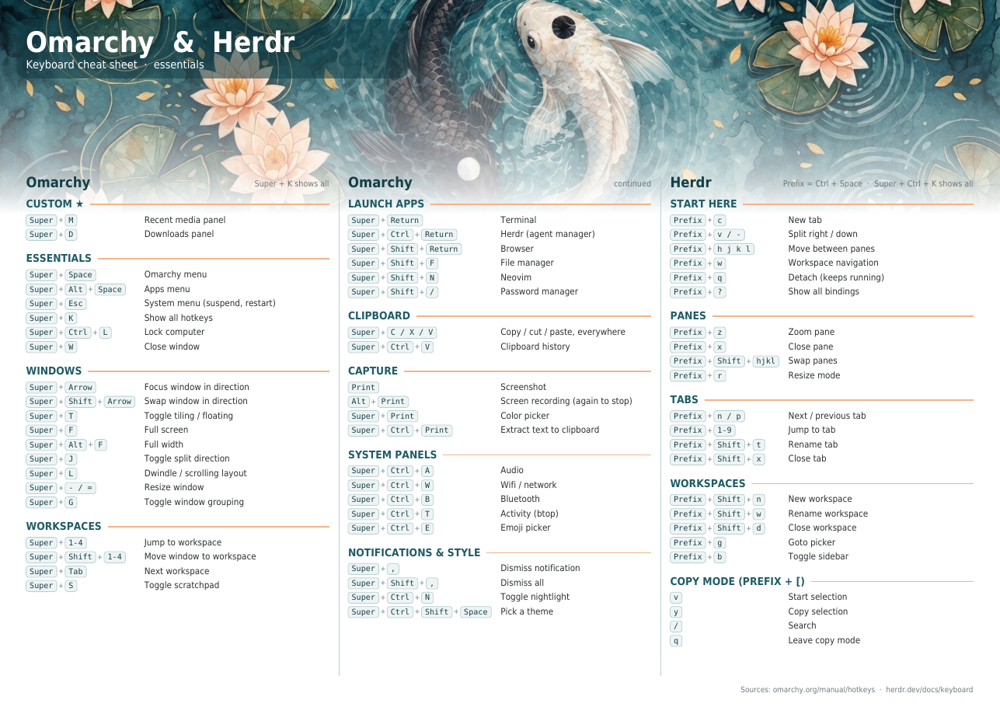
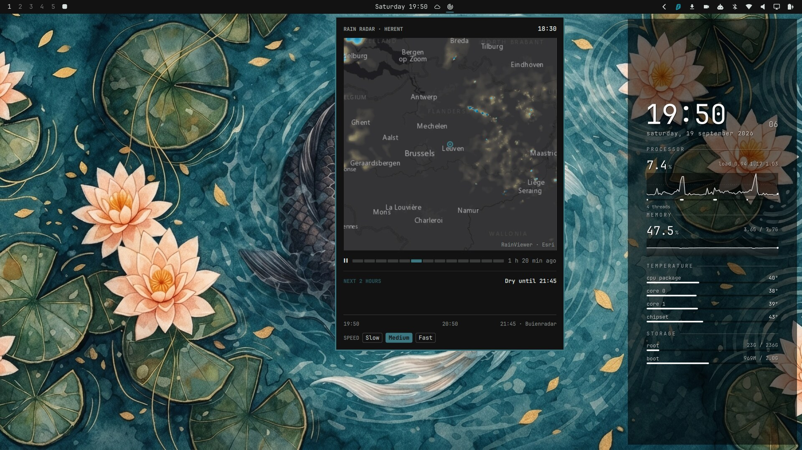

# omarchy-config

My customisations for [Omarchy](https://omarchy.org), packaged so a fresh
install can be set up with one command.


## Features

| | Feature | Docs |
|---|---|---|
| 🎨 | **Koi Pond theme**: dark teal Omarchy theme with a watercolour koi wallpaper | [themes.md](docs/themes.md) |
| 📊 | **Desktop stats panel**: click-through clock, CPU, RAM, temperature and disk column drawn on the wallpaper | [desktop-stats.md](docs/desktop-stats.md) |
| 🎬 | **Recently watched**: bar widget with recent VLC videos, resume points and the next episode | [vlc-recent.md](docs/vlc-recent.md) |
| 🟧 | **VLC theme**: VLC follows the active Omarchy theme through qt5ct | [themes.md](docs/themes.md#vlc) |
| 📁 | **Files theme**: Files (Nautilus) and other GTK apps use the active Omarchy theme's colours | [themes.md](docs/themes.md#files) |
| 🌐 | **Chrome theme**: Chrome theme extension generated from the active Omarchy theme | [themes.md](docs/themes.md#chrome) |
| 🐟 | **Plymouth splash**: Koi Pond boot and disk-unlock screen | [plymouth.md](docs/plymouth.md) |
| 🤖 | **herdr scratchpad**: herdr runs on the SUPER+S scratchpad from login, with Claude already started inside | [herdr-scratchpad.md](docs/herdr-scratchpad.md) |
| 🦈 | **Surfshark tweaks**: tray icon always visible, sticky auto-connect toast dismissed at login | [surfshark.md](docs/surfshark.md) |
| 🧲 | **Torrents**: headless qBittorrent; magnet links download to /data/downloads over the VPN; bar widget shows progress with stop/resume/remove | [torrents.md](docs/torrents.md) |
| 🌧️ | **Rain radar**: bar widget next to the weather with a looping rain radar map around Herent (RainViewer) and a two-hour rain forecast (Buienradar) | [radar.md](docs/radar.md) |
| ⌨️ | **Shortcuts**: SUPER+CTRL+Return herdr, SUPER+ALT+Return tmux, SUPER+SHIFT+/ KeePassXC, restored after removing the preinstalls | [shortcuts.md](docs/shortcuts.md) |
| 🐑 | **herdr keys**: herdr's default keybindings with Ctrl+Space as the prefix, instead of Omarchy's tmux-style remap, so the cheat sheets match | [herdr.md](docs/herdr.md) |
| 📺 | **sync-jellyfin.sh**: copies new movies, series and music to a Jellyfin share, sorted into season folders | [sync-jellyfin.md](docs/sync-jellyfin.md) |
| 🧠 | **Claude Code skills**: `/track-changes` records every change Claude makes into this repo, with install step, docs and screenshot | [claude-skills.md](docs/claude-skills.md) |

## Install

On a machine that already runs Omarchy:

```sh
git clone <this repo> ~/Git/omarchy-config
cd ~/Git/omarchy-config
./install.sh                  # everything
./install.sh vlc-recent vlc   # or only some components (see --list)
```

Components: `theme`, `vlc`, `chrome`, `files`, `vlc-recent`, `desktop-stats`, `plymouth`, `jellyfin`, `herdr-scratchpad`, `surfshark`, `torrents`, `radar`, `shortcuts`, `herdr`, `claude-skills`.

You can run the installer more than once. Before it changes a file it saves a
`.bak-<timestamp>` copy, and it adds each Hyprland line only once. It doesn't
touch `/usr/share/omarchy`, so `omarchy update` keeps your changes. Only
`plymouth` needs sudo.

There are two manual steps:
- **Chrome:** load `~/.local/state/omarchy/current/theme` as an unpacked extension
  (see [Chrome](docs/themes.md#chrome)). The installer first turns off Omarchy's
  Chrome colour policy, which would otherwise block the theme with "blocked by the
  administrator".
- **Copy URL (Chrome):** `Alt + Shift + L` copies the current tab's URL, but only
  once Omarchy's Copy URL extension is loaded. Chrome has ignored the
  `--load-extension` flag in `chrome-flags.conf` since version 137, so load it by
  hand: `chrome://extensions` -> Developer mode -> Load unpacked ->
  `/usr/share/omarchy/default/chromium/extensions/copy-url`, then check the
  shortcut in `chrome://extensions/shortcuts`. The manifest pins the extension ID,
  so the native host Omarchy already installed keeps working, and the extension is
  read from `/usr/share/omarchy`, so it follows Omarchy updates. The same applies
  to the `yt-dlp` and `whatsapp-slim` extensions on that flag line.
- **Desktop stats:** check the `DISKS` list at the top of
  `~/.config/hypr/scripts/desktop-stats.py` matches your mounts.

## herdr keybindings

Omarchy ships a herdr config that remaps most keys to mimic its tmux setup
(`Prefix + h` splits down, `Ctrl + Alt + Arrows` move between panes, `Prefix + k`
closes a tab). The `herdr` component replaces it with one that keeps only the
prefix and leaves every other binding at herdr's own default:

```toml
[keys]
prefix = "ctrl+space"
```

So `Prefix + v` / `Prefix + -` split, `Prefix + hjkl` moves between panes,
`Prefix + q` detaches and `Prefix + r` resizes - matching the cheat sheets below
and the SUPER+CTRL+K menu. `omarchy-refresh-herdr` restores Omarchy's tmux-style
config; run `./install.sh herdr` again to undo that. See
[herdr.md](docs/herdr.md).

## Cheat sheets

Printable keyboard cheat sheets for Omarchy and herdr, in the Koi Pond colours.
Both are a single A4-landscape page.

- [Essentials](cheat_sheets/omarchy-herdr-cheatsheet-v2.pdf) - the bindings you
  reach for daily, plus the custom `Super + M` / `Super + D` panels from this repo.
- [Expanded](cheat_sheets/omarchy-herdr-cheatsheet-expanded.pdf) - the same sheet
  with the fuller set of Omarchy and herdr bindings.



## Screenshots

### Desktop stats panel


### Rain radar widget
Bar button (radar icon, right of the weather):



### Recently watched (VLC) widget
Bar button (film icon, left of the agents icon):


### VLC following the theme


### Chrome following the theme


### Boot splash


## Layout

```
install.sh                  one-shot deployer
themes/koi-pond/            Omarchy theme (colors.toml + wallpaper)
cheat_sheets/               printable keyboard cheat sheets (PDF)
desktop-stats/              wallpaper stats panel (GTK4 layer-shell)
plugins/sepro.vlc-recent/   Omarchy shell bar widget
vlc/                        qt5ct palette template, qt5ct.conf, vlc.desktop
chrome/                     Chrome theme manifest template, chrome-flags.conf
plymouth/                   boot splash theme
herdr/config.toml           herdr config: default keys, Ctrl+Space prefix
herdr-scratchpad/           login launcher for herdr + Claude on the scratchpad
surfshark/                  login wrapper that starts Surfshark quietly
scripts/                    sync-jellyfin.sh
docs/                       documentation; docs/img has the screenshots
```
