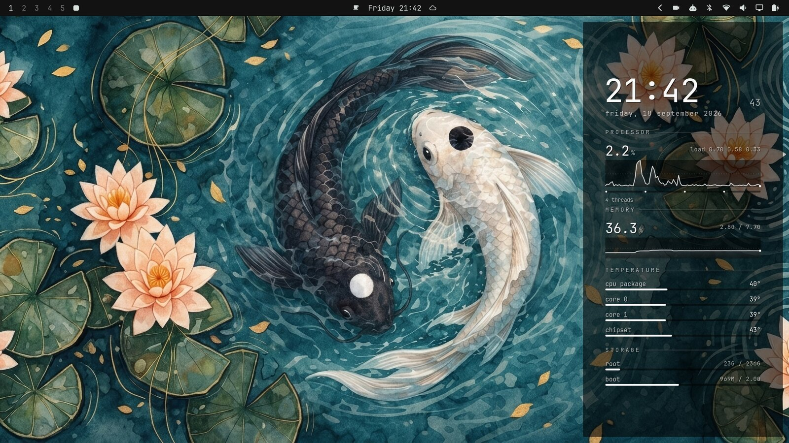
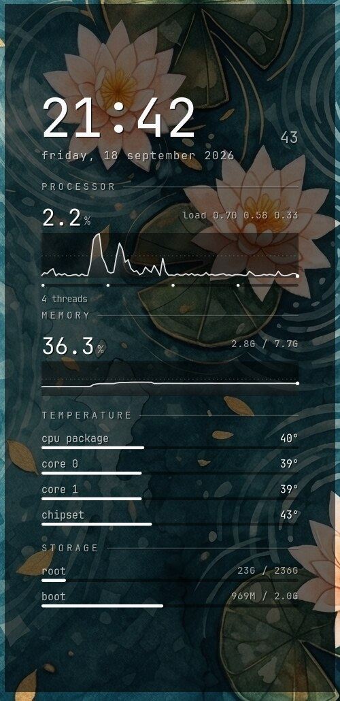
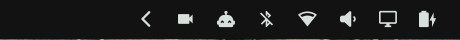
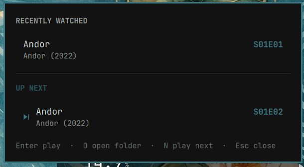
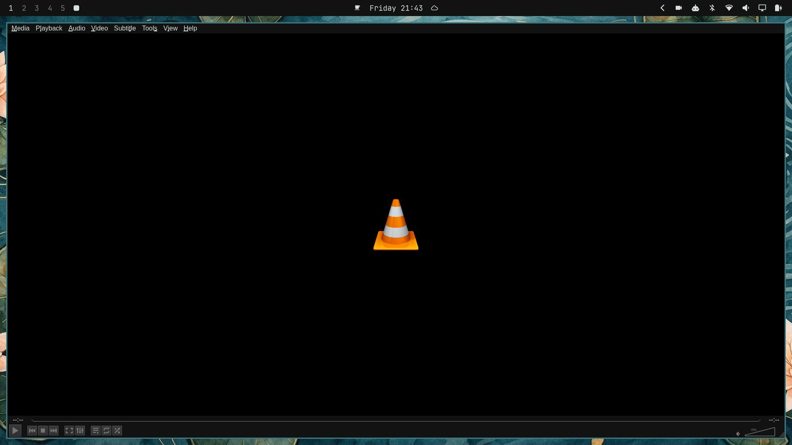
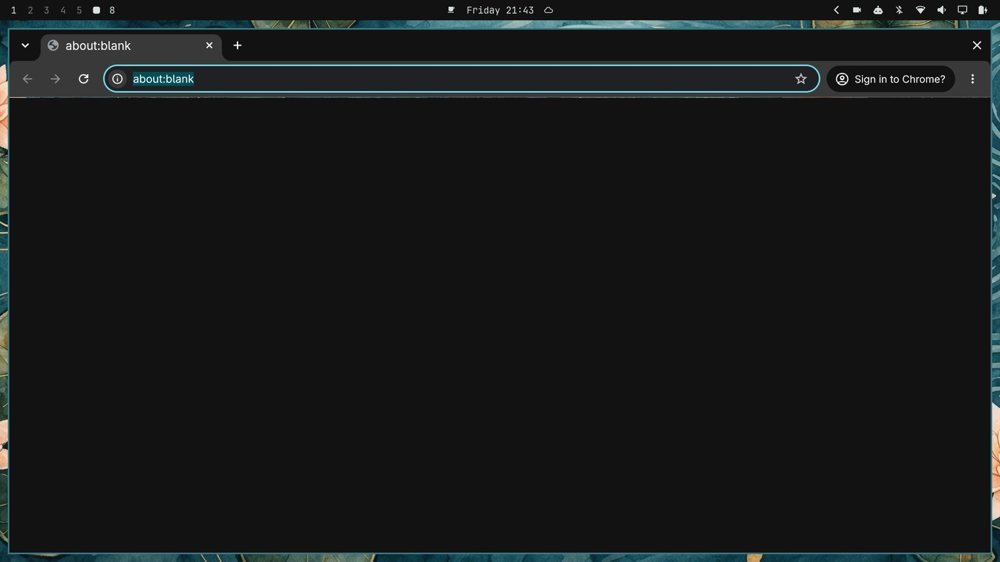
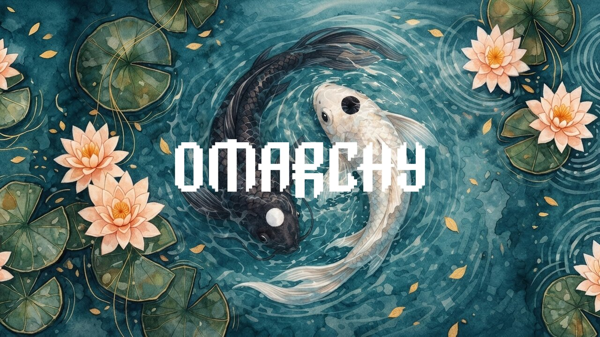

# omarchy-config

My customisations for [Omarchy](https://omarchy.org), packaged so a fresh
install can be set up with one command.



## Features

| | Feature | Docs |
|---|---|---|
| 🎨 | **Koi Pond theme**: dark teal Omarchy theme with a watercolour koi wallpaper | [themes.md](docs/themes.md) |
| 📊 | **Desktop stats panel**: click-through clock, CPU, RAM, temperature and disk column drawn on the wallpaper | [desktop-stats.md](docs/desktop-stats.md) |
| 🎬 | **Recently watched**: bar widget with recent VLC videos, resume points and the next episode | [vlc-recent.md](docs/vlc-recent.md) |
| 🟧 | **VLC theme**: VLC follows the active Omarchy theme through qt5ct | [themes.md](docs/themes.md#vlc) |
| 🌐 | **Chrome theme**: Chrome theme extension generated from the active Omarchy theme | [themes.md](docs/themes.md#chrome) |
| 🐟 | **Plymouth splash**: Koi Pond boot and disk-unlock screen | [plymouth.md](docs/plymouth.md) |
| 🤖 | **herdr scratchpad**: herdr runs on the SUPER+S scratchpad from login, with Claude already started inside | [herdr-scratchpad.md](docs/herdr-scratchpad.md) |
| 🦈 | **Surfshark tweaks**: tray icon always visible, sticky auto-connect toast dismissed at login | [surfshark.md](docs/surfshark.md) |
| 📺 | **sync-jellyfin.sh**: copies new movies and series to a Jellyfin share, sorted into season folders | [sync-jellyfin.md](docs/sync-jellyfin.md) |

## Install

On a machine that already runs Omarchy:

```sh
git clone <this repo> ~/Git/omarchy-config
cd ~/Git/omarchy-config
./install.sh                  # everything
./install.sh vlc-recent vlc   # or only some components (see --list)
```

Components: `theme`, `vlc`, `chrome`, `vlc-recent`, `desktop-stats`, `plymouth`, `jellyfin`, `herdr-scratchpad`, `surfshark`.

You can run the installer more than once. Before it changes a file it saves a
`.bak-<timestamp>` copy, and it adds each Hyprland line only once. It doesn't
touch `/usr/share/omarchy`, so `omarchy update` keeps your changes. Only
`plymouth` needs sudo.

There are two manual steps:
- **Chrome:** load `~/.local/state/omarchy/current/theme` as an unpacked extension
  (see [Chrome](docs/themes.md#chrome)). The installer first turns off Omarchy's
  Chrome colour policy, which would otherwise block the theme with "blocked by the
  administrator".
- **Desktop stats:** check the `DISKS` list at the top of
  `~/.config/hypr/scripts/desktop-stats.py` matches your mounts.

## Screenshots

### Desktop stats panel


### Recently watched (VLC) widget
Bar button (film icon, left of the agents icon):





### VLC following the theme


### Chrome following the theme


### Boot splash


## Layout

```
install.sh                  one-shot deployer
themes/koi-pond/            Omarchy theme (colors.toml + wallpaper)
desktop-stats/              wallpaper stats panel (GTK4 layer-shell)
plugins/sepro.vlc-recent/   Omarchy shell bar widget
vlc/                        qt5ct palette template, qt5ct.conf, vlc.desktop
chrome/                     Chrome theme manifest template, chrome-flags.conf
plymouth/                   boot splash theme
herdr-scratchpad/           login launcher for herdr + Claude on the scratchpad
surfshark/                  login wrapper that starts Surfshark quietly
scripts/                    sync-jellyfin.sh
docs/                       documentation; docs/img has the screenshots
```
