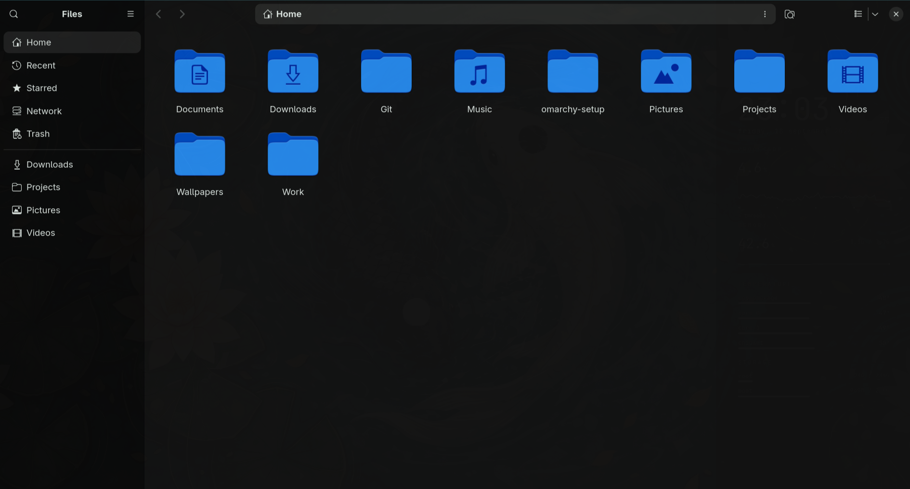

# Themes — Koi Pond, VLC, Files and Chrome

## Koi Pond (Omarchy theme)

A dark teal theme built around a watercolour koi wallpaper. Lives in
`themes/koi-pond/` (`colors.toml` + background), installed to
`~/.config/omarchy/themes/koi-pond/` and applied with `omarchy theme set koi-pond`.


| Role | Colour |
|---|---|
| background | `#121212` |
| foreground | `#d8e0dc` |
| accent | `#3C7882` |
| selection | `#2A3A38` |

Edit `colors.toml` and run `omarchy theme refresh` to see changes.

## VLC


VLC is a Qt5 app, so Omarchy's GTK theming doesn't reach it. The fix:

1. `vlc/qt5ct-colors.conf.tpl` → `~/.config/omarchy/themed/`. Omarchy renders
   every `*.tpl` in that folder on each `omarchy theme set`, so the palette is
   regenerated from whatever theme is active (light or dark).
2. `vlc/qt5ct.conf` → `~/.config/qt5ct/`, Fusion style with the rendered palette
   at `~/.local/state/omarchy/current/theme/qt5ct-colors.conf`.
3. `vlc/vlc.desktop` → `~/.local/share/applications/`. It sets
   `QT_QPA_PLATFORMTHEME=qt5ct` **only for VLC**, so other Qt apps are unchanged.

Needs the `qt5ct` package, which the installer adds.

## Files



Files (Nautilus) uses libadwaita, and Omarchy only sets it to Adwaita-dark,
so it doesn't use the theme's colours. The fix:

1. `files/gtk.css.tpl` → `~/.config/omarchy/themed/`. It is rendered to
   `~/.local/state/omarchy/current/theme/gtk.css` on each theme change, and it
   sets libadwaita's named colours (window, sidebar, header bar, cards, accent).
2. `~/.config/gtk-4.0/gtk.css` and `~/.config/gtk-3.0/gtk.css` contain only an
   `@import` of that file, so other GTK apps get the colours too.
3. `files/theme-set-nautilus` → `~/.config/omarchy/hooks/theme-set.d/`. GTK
   reads `gtk.css` only at startup, so the hook quits Nautilus after a theme
   change. The next time Files opens, it has the new colours.

If you already have your own `gtk.css`, the installer leaves it alone and
prints a warning. Copy the `@import` line into it yourself.

## Chrome


`chrome/manifest.json.tpl` → `~/.config/omarchy/themed/`. On every theme change
Omarchy renders it to `~/.local/state/omarchy/current/theme/manifest.json`, which
is a Chrome **theme extension** (frame, toolbar, tabs, omnibox and new-tab page
colours).

**One manual step, once per Chrome profile:** open `chrome://extensions`, turn
on *Developer mode*, choose *Load unpacked* and select
`~/.local/state/omarchy/current/theme`. The folder is hidden: in the file picker,
press **Ctrl+L** and paste or type the path, or press **Ctrl+H** to show hidden
folders. Branded Chrome ignores
`--load-extension`, so this can't be scripted. After a theme change, press
*Reload* on the extension card (or restart Chrome).

### "Blocked by the administrator"

Omarchy writes a Chrome policy (`/etc/opt/chrome/policies/managed/color.json`,
`BrowserThemeColor`) that only tints the toolbar. As long as that policy is
there, Chrome blocks **all** theme extensions. The installer moves the folder
aside. Omarchy only writes policies into folders that already exist, so it
stays off after later theme changes, and Chromium, Edge and Brave are not
affected:

```sh
sudo mv /etc/opt/chrome/policies/managed /etc/opt/chrome/policies/managed.omarchy-disabled
```

Restart Chrome, then *Load unpacked*. To undo it, move the folder back.

The installer also adds `--disable-features=WaylandFractionalScaleV1` to
`~/.config/chrome-flags.conf`. At fractional scaling (e.g. 1.5×) it removes a
see-through row between the toolbar and the page.
