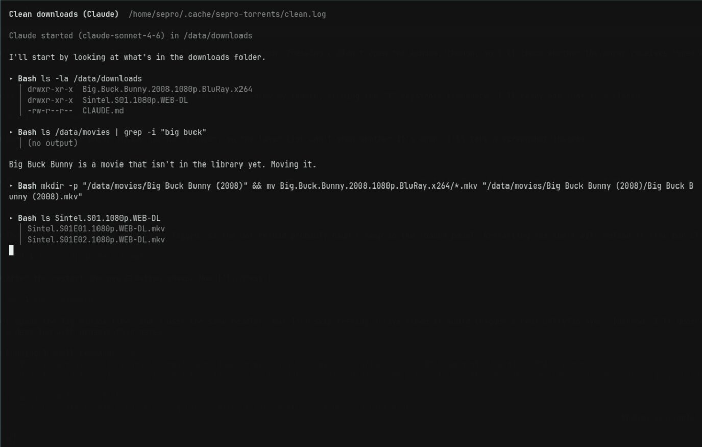

# Torrents: qbittorrent-nox with a bar widget

qBittorrent runs headless as a user service. Magnet links and `.torrent` files
download straight to `/data/downloads` with no dialog. A 󰇚 button in the bar
opens a popup that shows progress and lets you stop, resume and remove torrents.

## Install

```sh
./install.sh torrents
```

This does six things:
- installs `qbittorrent-nox`
- enables `~/.config/systemd/user/qbittorrent-nox.service`, which starts at login
- seeds `~/.config/qBittorrent/qBittorrent.conf` on the first install only
- registers `qbt-magnet.desktop` for `magnet:` links and `.torrent` files
- adds the `sepro.torrents` widget to the bar
- adds Hyprland rules to `~/.config/hypr/hyprland.lua` that float and centre the
  log terminal (app id `sepro.torrents-log`, 1100×700)

## Usage

| Action | Result |
|---|---|
| Click a magnet link / open a `.torrent` | Starts downloading; a notification shows the name |
| Left-click the button | Toggle the popup |
| SUPER + D | Toggle the popup from the keyboard |
| Right-click the button | Open the Web UI (http://127.0.0.1:8080) in the browser |
| Middle-click the button | Stop all (or resume all if everything is stopped) |
| 󰏤 / 󰐊 on a row, Enter | Stop / resume that torrent |
| 󰉋 on a row, O | Open its folder |
| 󰆴 on a row, X | Remove it from qBittorrent; **files are kept** |
| Header 󰏤/󰐊, S / R | Stop / resume all |
| Header 󰉋 | Open `/data/downloads` |
| Header 󰖟, W | Open the Web UI |
| Header 󰃢, C | Clean downloads: runs Claude (Sonnet, medium effort, auto mode) in the background on the rules in `/data/downloads/CLAUDE.md`; the summary arrives as a notification, the full log is in `~/.cache/sepro-torrents/clean.log` |
| Header 󰑓, J | Sync to Jellyfin: runs `sync-jellyfin.sh` in the background with a progress bar in the popup; log in `~/.cache/sepro-torrents/sync.log` |
| Header 󰆍, L | Show the log: a terminal floating in the middle of the screen follows what clean or sync is doing right now (or shows the last run) |

Clean and sync are disabled while any torrent is unfinished, and while either of them is already running.

## Watching clean and sync



Clean and sync run in the background, so the popup only shows that they are
busy. 󰆍 (or L) opens a terminal that follows the log live: each command
Claude runs and the start of its output, or `sync-jellyfin.sh`'s file list with
rsync's progress line updating in place. When the job ends the terminal says so
and closes on Enter; closing it earlier doesn't stop the job. With nothing
running, it shows the log of the last run.

For this, clean runs Claude with `--output-format stream-json`: plain `claude -p`
only prints the summary when it's done. `qbt.py` turns the events into readable
lines as they arrive. The terminal is `qbt.py follow <job>` in
`xdg-terminal-exec`, with app id `sepro.torrents-log`, so Hyprland floats and
centres it.

**Popup keys J, L and X:** Omarchy's `PanelKeyCatcher` treats `j`/`k`/`h`/`l`
as vim-style cursor keys and `x` as delete, so these keys never reached the
widget's own key handler: J only worked with Shift, and X did nothing. A small
focused item in `Panel.qml` now handles J and L before the catcher, and X is
wired to the catcher's delete signal. The arrow keys still move the cursor.

The Web UI is the full qBittorrent interface: priorities, files, trackers, settings.

## Settings

`qbt.py setup` (run by the installer) applies these through the Web API:

| Setting | Value |
|---|---|
| Save path | `/data/downloads` |
| Network interface | `surfshark_wg`. Torrents **only** use the Surfshark VPN, so if it drops they stall instead of leaking; the popup warns "No connection". |
| Seeding | none: a torrent stops as soon as it completes (ratio limit 0 → Stop) |
| Extra trackers | 15 live public trackers are added to every new torrent (`add_trackers`) |

**Why the extra trackers:** Surfshark doesn't forward ports, so other peers can't
connect to us and we only reach peers that accept incoming connections. On
small swarms that can mean 2–3 peers out of 20+ seeders. More live trackers
help find the connectable ones, and many older torrents only list dead
trackers (rarbg, coppersurfer, ...). The only real fix is a VPN with port
forwarding (ProtonVPN, AirVPN, PIA). If trackers on the list die, edit
`add_trackers` in `PREFERENCES`.

To change them, edit `PREFERENCES` at the top of
`~/.config/omarchy/plugins/sepro.torrents/qbt.py` and rerun it with `setup`, or
use the Web UI.

**Web UI login:** the UI listens on 127.0.0.1 only, and localhost doesn't need a
password (`WebUI\LocalHostAuth=false`). The trade-off is that any program
running as any user on this machine can control qBittorrent.

## How it works

| File | Role |
|---|---|
| `plugins/sepro.torrents/Panel.qml` | Bar button and popup; polls every 4 s (1.5 s while open) |
| `plugins/sepro.torrents/qbt.py` | Web API client: `status`, `add`, `stop`, `start`, `remove`, `folder`, `webui`, `clean`, `sync`, `log`, `setup` |
| `torrents/qbittorrent-nox.service` | User service (`--confirm-legal-notice`) |
| `torrents/qBittorrent.conf` | First-run config: Web UI on 127.0.0.1:8080, no localhost login |
| `torrents/qbt-magnet.desktop` | Magnet / `.torrent` handler → `qbt.py add` |

`qbt.py add` starts the service if it isn't running. Finished torrents stay in
the list (dimmed) until you remove them.

Check from a terminal:

```sh
systemctl --user status qbittorrent-nox
python3 ~/.config/omarchy/plugins/sepro.torrents/qbt.py status | jq
```
