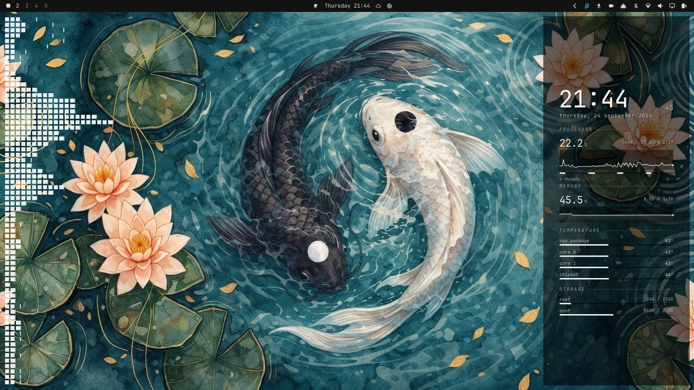

# Audio visualizer: cava bars on the left of the wallpaper

While music plays, a spectrum visualizer appears on the left edge of the
desktop. Each frequency band is a row of small white squares, with bass at
the top and treble at the bottom, growing to the right with the volume of
that band. A thin white line past each row marks its peak from the last
moments: it holds for 1.5 s, then falls back until a new peak pushes it out.



It sits on the wallpaper like the [desktop stats panel](desktop-stats.md):
windows cover it, and clicks go straight through to the desktop. It fades
in when any MPRIS player (Spotify, Feishin, VLC, a browser tab, ...) starts
playing. When playback pauses or stops, the bars drop to zero and it fades out
after 2 seconds, so skipping tracks doesn't make it flicker. cava only runs
while the visualizer is on screen.

## Install

```sh
./install.sh visualizer
```

This installs `cava` (needs sudo), copies the plugin to
`~/.config/omarchy/plugins/sepro.visualizer` and enables it in `plugins[]` of
`~/.config/omarchy/shell.json` (`omarchy plugin enable sepro.visualizer`).

## How it works

It is an Omarchy shell *service* plugin, not a bar widget, so it lives inside
the running `omarchy-shell`. It opens its own layer-shell surface
(namespace `sepro-visualizer`) on the `bottom` layer, which is above the
wallpaper and below windows, anchored to the left edge under the bar.

cava does the audio analysis. The plugin writes a cava config to
`$XDG_RUNTIME_DIR/sepro-visualizer.cava` with one bar per row that fits on
screen, reads cava's raw ASCII output (one line of levels per frame, 60 fps),
and draws the squares and peak lines itself. Stock cava can't draw square
blocks or peak-hold lines. Play state comes from Quickshell's MPRIS service.

The look is set by the properties at the top of `Service.qml`:

| Property | Default | Meaning |
|---|---|---|
| `square` / `gap` | 8.8 / 3.2 | Square size and spacing in logical px (11 / 4 px at 1.25 scale) |
| `maxCells` | 38 | Longest row, in squares |
| `holdMs` / `fallCells` | 1500 / 15 | Peak hold time, then fall speed in squares per second |
| `graceMs` / `fadeMs` | 2000 / 400 | Delay before hiding after pause, fade duration |

Edits to the installed copy reload immediately. Copy them back into
`plugins/sepro.visualizer/` to keep them.

## Troubleshooting

- **Nothing appears:** check `jq .plugins ~/.config/omarchy/shell.json` lists
  `sepro.visualizer` and that `pgrep -a cava` shows a process while music plays.
  Players that don't publish MPRIS (some web players) won't trigger it.
- **Bars stay flat:** cava reads the default PipeWire output's monitor; check
  the music plays through the default output device.
